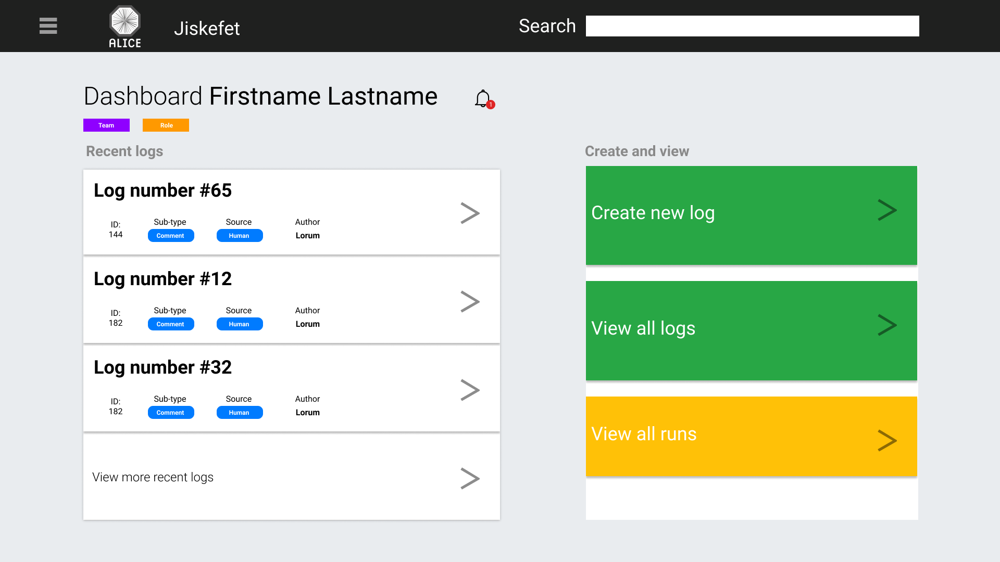

# CERN - Jiskefet

A tool for discussing meta data on ALICE.

## Table of contents

- [Dashboard](#dashboard)
  - [Filterset](#Filterset)
  - [Recentlogs](#Recentlogs)
  - [Personal workspace](#Personal workspace)

## Dashboard

Currently the start is an unsorted large set of data, which is identical for every user. Ideally there should be some directions or links to guide users to a prefered location.

Using a homepage/dashboard that can guide users towards specific paths such as

- A set of filters
- Creating a new log
- Viewing self made logs
- Notification tray

_A mockup of the Jiskefet Dashboard_

This dashboard can be made to be customizable. This feature can either coexists with or replace the current side-menu. To further enhance understanding of the structure, a breadcrumbs-like secondary navigation can be added, that would use the following structure:

`Filter/search -> Run -> Log -> Comment`

### Search

The current filter options are a combination of searches and filters. In some cases (such as an 'LOG ID') the user is expecting result of a **single entry**. While other filter options (such as 'Start Creation Time'), the user expects a list of entrees, which he/she can narrow down.

Using these two under a single filter block might confuse the user. Therefore the dashboard uses a search function in which the user can search for specific results.

### Filtersets

Instead of having to manually input a list of filters every time, the user can opt to save a list of filter conditions as a "filterset". This filterset can show up on the dashboard, giving the user a ideal workflow.

This filterset links to the same page a user would get if he'd manually input multiple filters. This helps the user with the understanding where he/she is within the app, while also making the user aware he can still change the conditions as he normally would.

### Recent logs

The dashboard should feel like its aware of the user. By showing the logs the user has interacted with, the user will have a way to come back to logs that are relevant for that specific user.

This design assumes there is a need to go back to older logs. If that wouldn't be the case, this part of the design can be replaced by using 'active logs' where the items that are relevant to the user through the use of a tagging system in comments.

### Personal workspace

Certain sections of Jiskefet will be more frequently used by certain staff members than others. With this dashboard, using different user roles to create workspace that is catered to specific use cases of a staff member.

Different teams can be made for groups of people that should have the same kind of privileges. Individual tags or roles could be established to grant access or differentiate users within a team. ie A team could be "Detector 1", where as a role would be "Team leader".
